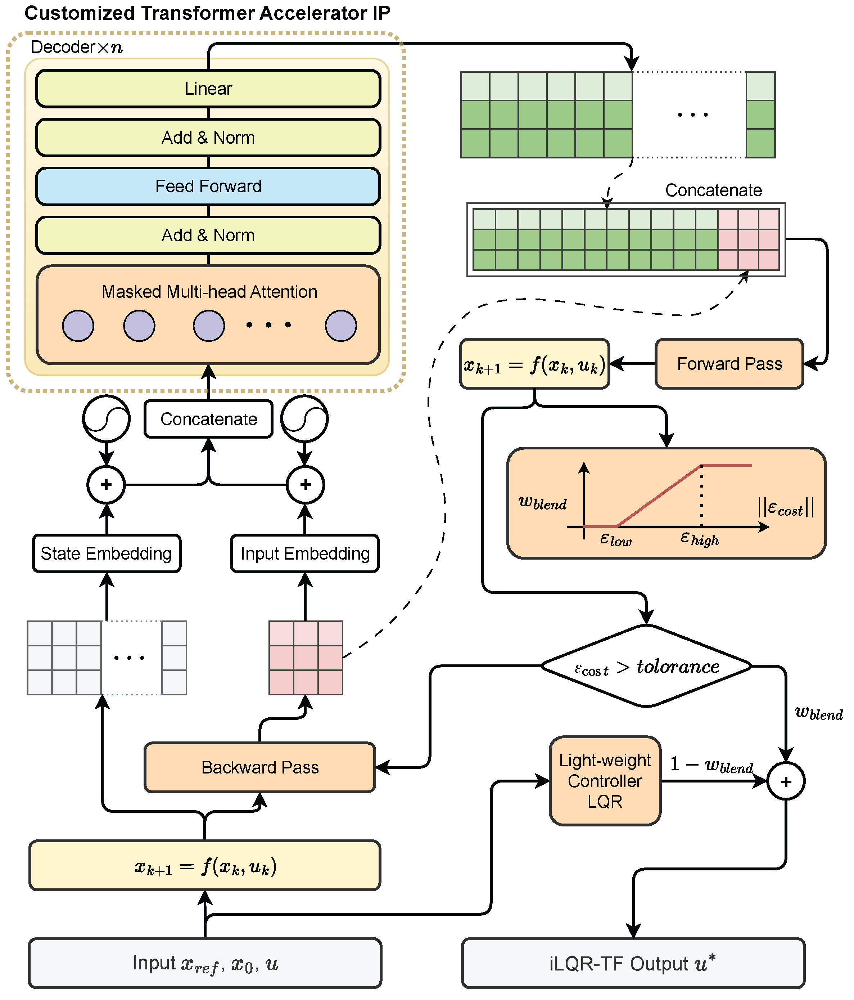
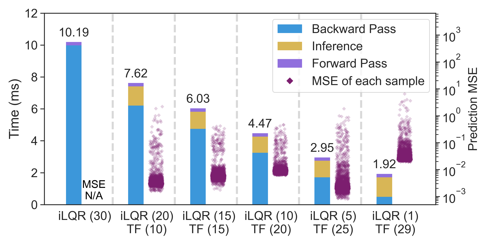
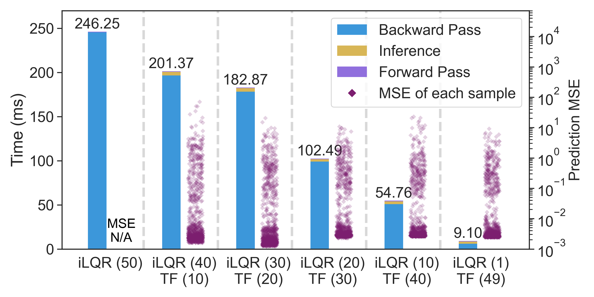

# Quattro: Transformer-Accelerated iterative Linear Quadratic Regulator (iLQR)

Quattro is an open-source framework designed to enhance the efficiency of iterative Linear Quadratic Regulators (iLQR) through the innovative integration of Transformer models. By accelerating intermediate computations in iLQR algorithms, Quattro significantly improves real-time optimal control capabilities for nonlinear robotic systems.

<div align="center">
  
</div>

## Overview

Real-time optimal control remains challenging in robotics due to the sequential nature of traditional iLQR methods. Quattro addresses this by employing a Transformer model to concurrently predict feedback and feedforward matrices, allowing parallel computation without sacrificing control accuracy.

<div align="center">
  
</div>


## Key Contributions
- **Transformer-Accelerated iLQR**: Parallel computation enabled by Transformer-based prediction of intermediate feedback and feedforward matrices.
- **Validated Performance**: Demonstrated substantial acceleration and accuracy on cart-pole and quadrotor systems.
- **FPGA Implementation**: Utilizes a customized Transformer accelerator IP on FPGA, achieving up to 27.3× performance improvements and significant power efficiency.

## Performance Highlights
- **Algorithm-Level Acceleration**:
<div align="center">  <p><em>Figure 1: Cart-Pole simulation result using Quattro. Up to 5.3× per iteration.</em></p> </div> <div align="center">  <p><em>Figure 2: Quadrotor simulation result using Quattro. Up to 27× per iteration.</em></p> </div>

- **Overall MPC Speedup**:
  - Cart-Pole: 2.8×.
  - Quadrotor: 17.8×.

## Installation
We recommend use virtual environment e.g. `conda`. The project is based on `Python 3.10`.

```bash
# (Optional) set up a virtual enviroment 
conda create --name quattro python=3.10
conda activate quattro

git clone https://github.com/YueWang996/quattro-transformer-ilqr
cd quattro-transformer-ilqr

# Option 1 (recommanded): install the quattro_ilqr_tf directly as a package
pip install -e .

# Option 2: install the requirements manually and cpoy the framework files 
# directly into your project
pip install -r requirements.txt
```


## Usage

### Project Structure

- `quattro_ilqr_tf/`  
  The core Quattro framework, including all the model and control implementations.

- `examples/`  
  Contains demonstration simulations and training workflows for cart-pole and quadrotor systems:
  - `cartpole/`: Runs a cart-pole simulation using `cartpole_sim.py`.
  - `cartpole/training/`: Includes scripts for data collection and model training.
    - `training_data_collection.py`: Collects simulation data using multi-core processing.
    - `transformer_training.py`: Trains the Transformer ILQR model on local or remote high-performance systems.
    - `transformer_training.ipynb`: Provides a step-by-step Jupyter Notebook guide for training.
  
- `TODO:hardware/`
  FPGA-related files and customized Transformer accelerator IP.

- To generate training data and develop the Transformer model:
   - Use `training_data_collection.py` from the `examples/cartpole/training` folder to collect simulation logs.
   - Train the model using `transformer_training.py` or follow the interactive guide in `transformer_training.ipynb`.


## Citation
Please cite this project if you find it useful:
```
@article{wang2025quattro,
  title={Quattro: Transformer-Accelerated Iterative Linear Quadratic Regulator Framework for Fast Trajectory Optimization},
  author={Wang, Yue and Wang, Haoyu and Li, Zhaoxing},
  journal={arXiv preprint arXiv:2504.01806},
  year={2025}
}
```

## License
This project is licensed under the MIT License - see the [LICENSE](LICENSE) file for details.

